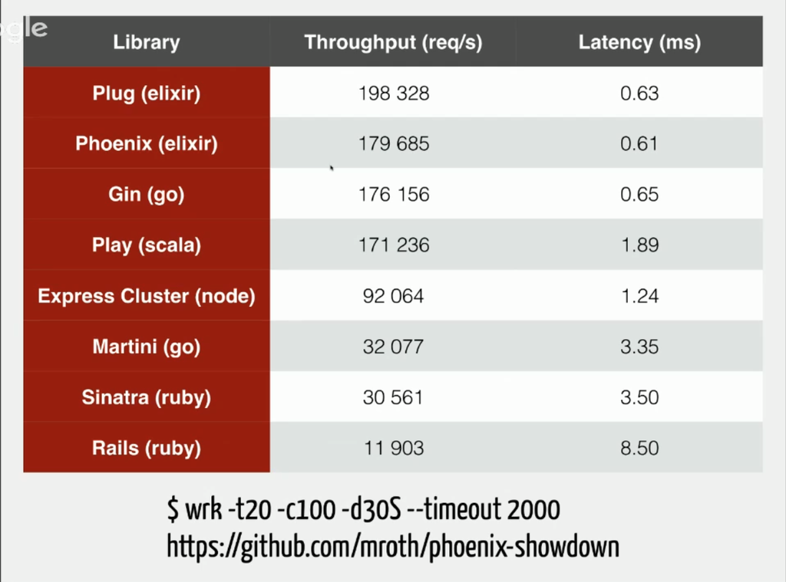

Intro a Elixir
===================


## ¿Porque Elixir? ##

[Whatsapp en el 2011](https://blog.whatsapp.com/196/1-million-is-so-2011)

### 2 Millones de Conexiones ###
**Servidores**
```
Intel(R) Xeon(R) CPU X5675 @ 3.07GHz
24 CPU con 96 GB RAM
```
Aun así usaban solo el 40% del CPU
```
CPU: 37.9% user,  0.0% nice, 13.6% system,  6.6% interrupt, 41.9% idle Mem: 35G Active, 14G Inact, 18G Wired, 4K Cache, 9838M Buf, 27G Free
```



**¿Como?**
### Maquina Virtual de Erlang ###

* Procesos *Ligeros* - Desde 512 Bytes
* Estabilidad - Casi 30 años
* OTP


### Instalación ###
[Guía](http://elixir-lang.org/install.html)

Funciona en Windows, Linux, Mac. Sin problema.


### Empezando con Elixir ###

Tiene tres ejecutables `iex`, `elixir`, `elixirc`

*Modo Interactivo*
Con `iex`
```
Interactive Elixir - press Ctrl+C to exit (type h() ENTER for help)

iex> 40 + 2
42
iex> "hello" <> " world"
"hello world"
```


*Modo Script*
Con `elixir`

```
elixir simple.exs
```


### Tipos básicos ###

```
iex> 1          # integer
iex> 0x1F       # integer
iex> 1.0        # float
iex> true       # boolean
iex> :atom      # atom / symbol
iex> "elixir"   # string
iex> [1, 2, 3]  # list
iex> {1, 2, 3}  # tuple
```
* Integer
* Float
* Boolean
* Atom
* String
* List
```
[1, 2, 3] ++ [4, 5, 6]
```
```
lista =  [1, 2, 3]
lista[0]
hd(lista)
tl(lista)
```
* Tuple
```
tupla = {1,2,3}
elem(tupla,1)
```
### Funciones Anónimas ###
```
add = fn a, b -> a + b end
add.(1, 2)
```
### Pattern Matching ###
```
{a, b, c} = {:hello, "world", 42}
{:ok, result} = {:ok, 13}
[head | tail] = [1, 2, 3]
```
